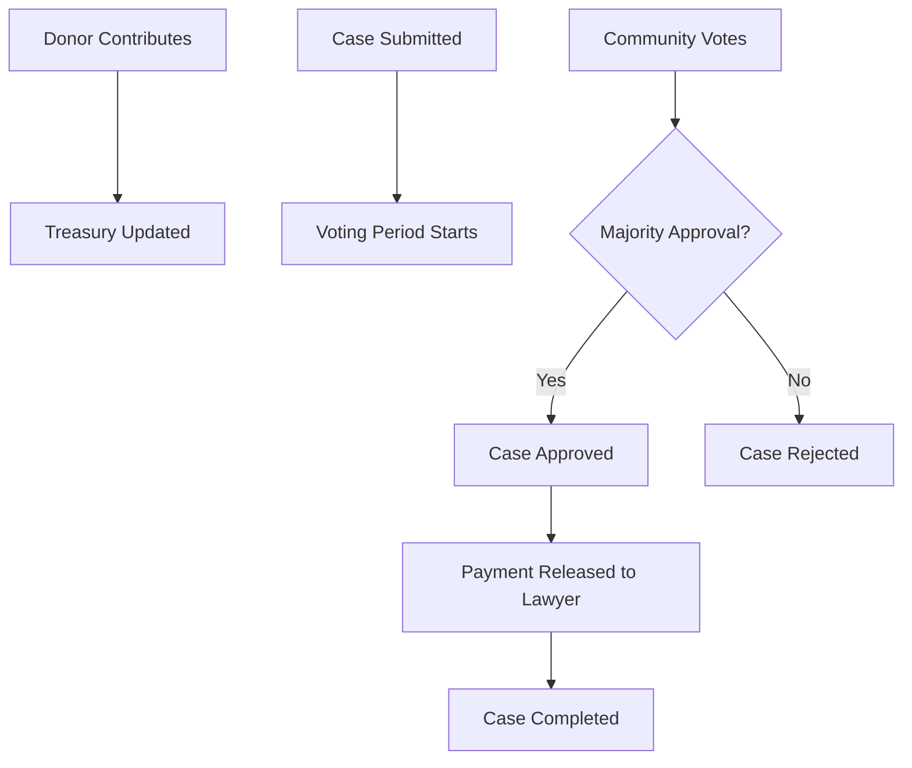

# Open Legal Aid DAO ⚖️

A decentralized autonomous organization (DAO) that democratizes access to legal aid by creating a transparent, community-governed donation pool for funding legal cases for underrepresented groups.

## 🎯 Purpose

Many underrepresented communities lack access to affordable legal representation. This DAO solves that problem by:
- 💰 Creating a community-funded donation pool
- 🗳️ Enabling democratic voting on which cases to fund
- 🏛️ Connecting qualified lawyers with those in need
- 📊 Ensuring transparent fund distribution through smart contracts

## 🚀 Features

### Core Functionality
- **Donation Pool**: Community members donate STX to build a treasury
- **Case Submission**: Anyone can submit legal cases for funding consideration
- **Democratic Voting**: Donors vote on which cases deserve funding
- **Transparent Payments**: Approved cases receive automatic payment to assigned lawyers
- **Lawyer Registration**: Legal professionals can register and build reputation

### Smart Contract Components
- **Treasury Management**: Secure handling of donated funds
- **Voting System**: Time-bound voting with quorum requirements
- **Reputation Tracking**: Lawyer performance and case history
- **Emergency Controls**: Owner-only emergency fund withdrawal

## 📋 Usage Instructions

### 🎁 For Donors
1. **Make a Donation**
   ```clarity
   (contract-call? .open-legal-aid-dao donate u1000000) ;; Donate 1 STX (minimum)
   ```

2. **Vote on Cases**
   ```clarity
   (contract-call? .open-legal-aid-dao vote-on-case u1 true) ;; Vote yes on case #1
   ```

### 👩‍⚖️ For Lawyers
1. **Register as a Lawyer**
   ```clarity
   (contract-call? .open-legal-aid-dao register-lawyer "Jane Doe" "Housing Rights")
   ```

2. **Check Your Profile**
   ```clarity
   (contract-call? .open-legal-aid-dao get-lawyer-info 'SP1234...)
   ```

### 📝 For Case Submitters
1. **Submit a Legal Case**
   ```clarity
   (contract-call? .open-legal-aid-dao submit-case 
     "Housing Discrimination Case" 
     "Client facing unlawful eviction due to discrimination..." 
     u5000000  ;; 5 STX requested
     'SP-LAWYER-ADDRESS)
   ```

2. **Release Payment** (after approval)
   ```clarity
   (contract-call? .open-legal-aid-dao release-payment u1)
   ```

### 🔍 For Everyone
1. **View Case Details**
   ```clarity
   (contract-call? .open-legal-aid-dao get-case u1)
   ```

2. **Check DAO Statistics**
   ```clarity
   (contract-call? .open-legal-aid-dao get-dao-stats)
   ```

3. **Monitor Voting Status**
   ```clarity
   (contract-call? .open-legal-aid-dao get-voting-status u1)
   ```

## 🛠️ Development

### Prerequisites
- [Clarinet](https://docs.hiro.so/stacks/clarinet) installed
- Node.js and npm for testing

### Quick Start
```bash
# Check contract syntax
clarinet check

# Run tests
npm install
npm test

# Deploy to testnet
clarinet deploy --testnet
```

### Contract Constants
- **Minimum Donation**: 1 STX (1,000,000 microSTX)
- **Voting Period**: 144 blocks (~24 hours)
- **Quorum Threshold**: 3 votes minimum

## 📊 Contract Flow



## 🔒 Security Features

- **Access Control**: Role-based permissions for different functions
- **Voting Requirements**: Only donors can vote on cases
- **Time-bound Voting**: Limited voting periods prevent manipulation
- **Quorum Requirements**: Minimum vote threshold ensures community consensus
- **Emergency Controls**: Contract owner can withdraw funds in emergencies

## 🤝 Contributing

1. Fork the repository
2. Create a feature branch
3. Write tests for new functionality
4. Ensure `clarinet check` passes
5. Submit a pull request

## 📜 License

This project is open source and available under the [MIT License](LICENSE).

## 🎯 Impact Goals

- **Expand Legal Access**: Provide funding for 100+ legal cases annually
- **Support Vulnerable Communities**: Focus on housing, immigration, and civil rights cases
- **Build Trust**: Maintain 100% transparency in fund allocation
- **Empower Citizens**: Give community members direct say in social justice funding

## 🔗 Links

- [Stacks Documentation](https://docs.stacks.co/)
- [Clarity Language Reference](https://docs.stacks.co/clarity/)
- [DAO Best Practices](https://ethereum.org/en/dao/)

---

*Made with ❤️ for social justice and legal equity*
